## Overview

This repository provides tools to set up and manage temporary development boxes
on AWS. The main purpose is to allow us to persist a development environment
across different runs. So a developer can log into a DevBox "project", make
changes, terminate the instance, and then the changes will be retained the next
time the developer logs in.

### DevBox Lifecycle

A DevBox follows a specific lifecycle that automatically preserves your
development environment:

1. **Launch**: The CLI launches an EC2 instance from either a base AMI (for new
   projects) or a previously saved project AMI (for existing projects)
2. **Development**: You SSH into the instance and work on your code, install
   packages, modify files, etc.
3. **Termination**: When you're done, the instance is terminated (either
   manually through the AWS console or via CLI)
4. **Automatic Snapshot Process**: Upon termination, a series of Lambda
   functions are triggered by CloudWatch events:
   - All EBS volumes attached to the instance are automatically snapshot
   - Snapshot metadata is tracked in DynamoDB tables
   - Once all snapshots complete, a new AMI is created from the snapshots
   - The old AMI and its associated snapshots are cleaned up
   - Detached volumes are automatically deleted
5. **Ready State**: The project is marked as "READY" and available for the next
   launch
6. **Next Launch**: When you launch the project again, it uses the newly
   created AMI containing all your previous work

This process ensures that your development environment persists across instance
launches while minimizing storage costs by cleaning up intermediate resources.

```mermaid
flowchart LR
  %% Phases
  classDef devPhase fill:#BBDEFB,stroke:#1976D2,stroke-width:2px;
  classDef launchPhase fill:#C8E6C9,stroke:#388E3C,stroke-width:2px;
  classDef lambdaPhase fill:#FFECB3,stroke:#F57C00,stroke-width:2px;
  classDef readyPhase fill:#D1C4E9,stroke:#5E35B1,stroke-width:2px;
  classDef terminatePhase fill:#FDE2E4,stroke:#C62828,stroke-width:2px,color:#4A0F0F;

  %% Nodes
  A[🚀&nbsp;Launch] --> B[💻&nbsp;Hack&nbsp;Hack&nbsp;Hack]
  B --> C[💥&nbsp;Terminate]

  subgraph "Lambda Functions"
    D[💾&nbsp;Snapshot] --> E[📦&nbsp;Create&nbsp;AMI]
    E --> F[🧹&nbsp;Cleanup]
    F --> G[✅&nbsp;Mark&nbsp;Ready]
    D --> I[🗑️&nbsp;Delete&nbsp;Volumes]
  end

  C --> D
  G --> A


  %% Class assignments
  class A launchPhase;
  class B devPhase;
  class C terminatePhase;
  class D,E,F,G,I lambdaPhase;
  class H readyPhase;
```




## AWS Account Setup

This is a once-per-AWS-account process. Individual users will not need to do this.

Create `main.tf` with contents similar to the following:

```hcl
provider "aws" {
  region = "us-east-1"
}

module "devbox" {
  source = "github.com/omsf-eco-infra/devbox"
  # options you can set; these are the defaults
  # prefix = "devbox"
  # vpc_cidr = "10.219.0.0/16"
  # ssh_cidr_blocks = ["0.0.0.0/0"]
}
```

Assuming you have OpenTofu (alternately, Terraform) installed and that you have
AWS credentials, run:

## Individual User Setup

**Prerequisite:** You must have an AWS account and the AWS CLI installed and
configured.

Each user will have to complete these steps once, but this will be reused
between different DevBox projects.

1. Set up your SSH keys.
   - Generate a new SSH key pair if you don't have one.
   - Add the public key to your AWS account's EC2 key pairs.


## Project Setup

This is for an individual DevBox project.

## Troubleshooting

### connect to host `<ip>` port 22: Connection refused

Sometimes you'll get this error if you try to SSH into a DevBox immediately
after it starts running. This is because sometimes the networking is not fully
set up yet. Wait a few seconds and try again.
